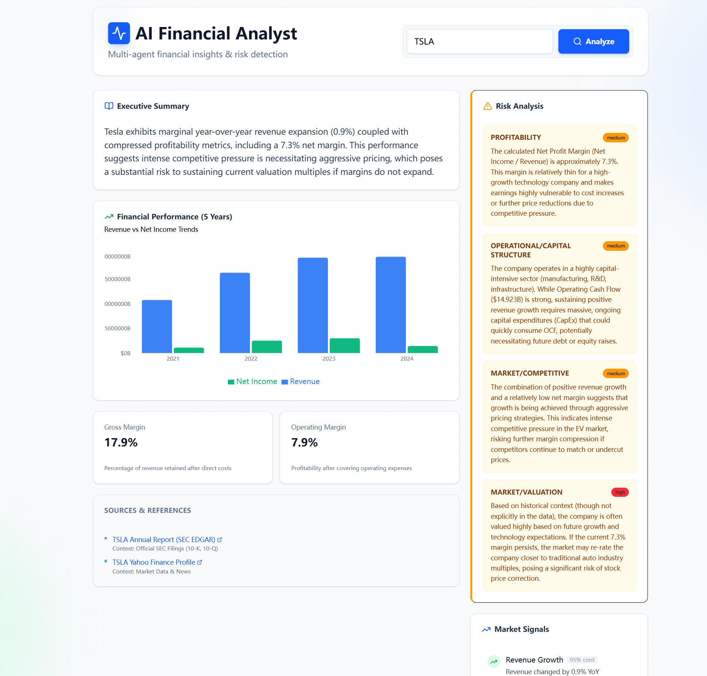

# AI Financial Analyst 📈

A professional, multi-agent financial analysis platform that leverages Large Language Models (LLMs) to provide real-time insights, risk detection, and comprehensive financial reports for public companies.


*(Note: Replace the placeholder above with your actual screenshot URL after uploading to GitHub)*

## ✨ Key Features

*   **Multi-Agent Architecture**:
    *   **Data Agent**: Fetches real-time financial data (Income Statement, Balance Sheet, Cash Flow) using `yfinance`.
    *   **Trend Agent**: Analyzes historical data to identify growth patterns and market signals.
    *   **Risk Agent**: Uses LLMs (Gemini/GPT) to scan financial metrics for potential risks (Liquidity, Solvency, Profitability).
    *   **Narrative Agent**: Synthesizes all data into a professional "Executive Summary" and detailed report.
*   **Real-time Data**: Integrated with Yahoo Finance API for up-to-date market data.
*   **Intelligent Insights**: Powered by Google Gemini (Free Tier supported) or OpenAI GPT-4.
*   **Interactive Dashboard**: Modern Next.js frontend with:
    *   5-Year Financial Performance Charts (Revenue vs Net Income).
    *   Dynamic Risk Analysis Badges.
    *   Executive Summaries generated in real-time.
    *   Direct links to SEC EDGAR filings and official reports.

## 🛠️ Tech Stack

*   **Frontend**: Next.js 14 (App Router), Tailwind CSS, Recharts, Lucide React.
*   **Backend**: FastAPI, LangChain, LangGraph, Pydantic.
*   **AI/LLM**: Google Gemini (via `langchain-google-genai`) or OpenAI.
*   **Data Source**: `yfinance` (Yahoo Finance API).

## 🚀 Getting Started

### Prerequisites

*   Python 3.10+
*   Node.js 18+
*   A Google API Key (Free) or OpenAI API Key.

### 1. Backend Setup

1.  Navigate to the backend directory:
    ```bash
    cd backend
    ```

2.  Install Python dependencies:
    ```bash
    pip install -r requirements.txt
    ```

3.  **Configure API Keys**:
    *   Rename `.env.example` to `.env`:
        ```bash
        mv .env.example .env
        ```
    *   Open `.env` and paste your API Key:
        ```env
        # Recommended: Free Tier available
        GOOGLE_API_KEY=your_gemini_api_key_here
        
        # Optional: If you prefer OpenAI
        # OPENAI_API_KEY=your_openai_key_here
        ```

4.  Start the backend server:
    ```bash
    uvicorn app.main:app --reload --host 0.0.0.0 --port 8000
    ```
    The API will run at `http://localhost:8000`.

### 2. Frontend Setup

1.  Open a new terminal and navigate to the frontend directory:
    ```bash
    cd frontend
    ```

2.  Install dependencies:
    ```bash
    npm install
    ```

3.  Start the development server:
    ```bash
    npm run dev
    ```

4.  Open your browser and visit `http://localhost:3000`.

## 💡 Usage

1.  Enter a valid US stock ticker (e.g., `AAPL`, `TSLA`, `NVDA`, `MSFT`) in the search bar.
2.  Click **Analyze**.
3.  Wait for the Multi-Agent system to fetch data, compute metrics, and generate the report (usually takes 3-5 seconds).
4.  Review the **Executive Summary**, **Risk Analysis**, and **Financial Charts**.

## ☁️ Deployment Guide

The easiest way to deploy this full-stack application for **free** is to use **Render** for the Backend and **Vercel** for the Frontend.

### Step 1: Deploy Backend (Render)
1.  Push your code to a GitHub repository.
2.  Create a new **Web Service** on [Render](https://render.com/).
3.  Connect your repository.
4.  **Settings**:
    *   **Root Directory**: `backend`
    *   **Build Command**: `pip install -r requirements.txt`
    *   **Start Command**: `uvicorn app.main:app --host 0.0.0.0 --port 10000` (Render uses port 10000 by default)
5.  **Environment Variables**:
    *   Add `PYTHON_VERSION` = `3.10.0`
    *   Add `GOOGLE_API_KEY` = `your_gemini_key`
6.  Deploy! Once finished, copy your backend URL (e.g., `https://your-app.onrender.com`).

### Step 2: Deploy Frontend (Vercel)
1.  Create a new project on [Vercel](https://vercel.com/).
2.  Connect the same GitHub repository.
3.  **Settings**:
    *   **Root Directory**: `frontend` (Vercel will auto-detect Next.js)
4.  **Environment Variables**:
    *   Add `NEXT_PUBLIC_API_URL` = `https://your-app.onrender.com` (Your Render Backend URL, **without** a trailing slash)
5.  Deploy!

---

### ❓ FAQ: API Costs & Free Tier

**Q: Will I be charged if others use my deployed site?**
*   **Google Gemini Free Tier**: No. The free tier has strict rate limits (Requests Per Minute/Day). If your site becomes popular and hits these limits, the API will simply return a `429 Resource Exhausted` error, and the AI features will temporarily pause. You will **not** be charged unless you explicitly upgrade to a paid plan.
*   **OpenAI API**: Yes. OpenAI does not have a "free tier" for API usage (only free trial credits). If you use an OpenAI Key, you will be billed per token. **Recommendation**: Stick to Gemini for a truly free personal project.

**Q: Is it safe to put my API Key in Render?**
*   **Yes**. Environment variables on Render/Vercel are stored securely on the server. Your API Key is **never** exposed to the frontend browser or the user.

## 🤝 Contributing

Contributions are welcome! Please feel free to submit a Pull Request.